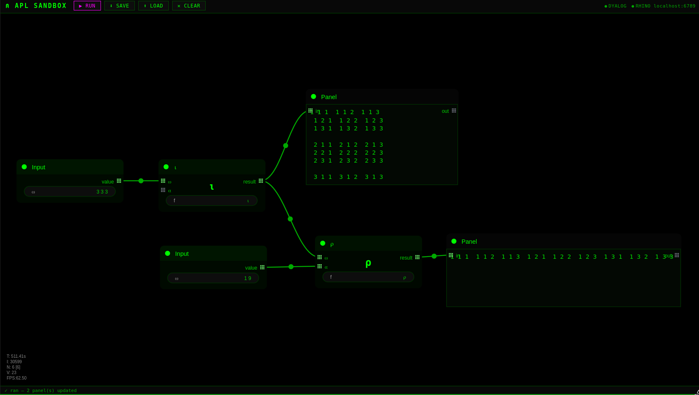

# APL Sandbox

A visual node-based environment for learning and exploring Dyalog APL.
Connect nodes representing APL glyphs, trains, and dfns to build
expressions interactively — with live evaluation and panel output
at each step, similar to Grasshopper for Rhino 3D.

Built with [litegraph.js](https://github.com/jagenjo/litegraph.js).
Vibe-coded with [Claude](https://claude.ai) (Anthropic).

---

## What it does

- **Input nodes** — enter APL literals (`1 2 3`, `3 3⍴⍳9`, `'hello'`)
- **Function nodes** — type any APL expression: a glyph (`⍳`), reduction
  (`+/`), train (`(+/÷≢)`), or dfn (`{⍺+⍵}`). Connect ⍵ (required)
  and ⍺ (optional)
- **Panel nodes** — display the result of any connected node, updated
  on each run
- Wire nodes together to compose expressions step by step and inspect
  intermediate results

Right-click the canvas to add nodes.

---

## Requirements

- Python 3.7+
- [Dyalog APL](https://www.dyalog.com/download-zone.htm) (free for
  non-commercial use) — specifically the `dyalogscript` binary

---

## Installation

```bash
git clone https://github.com/duanerobot/APL_Sandbox
cd APL_Sandbox
python3 server.py
```

Then open **http://localhost:5000** in a browser.

The server auto-detects `dyalogscript` if it is on your PATH. If it
is not found, set `DYALOG_PATH` at the top of `server.py`:

```python
DYALOG_PATH = '/path/to/dyalogscript'
```

No other dependencies — litegraph.js is loaded from CDN.

---

## Keyboard shortcuts

| Key | Action |
|-----|--------|
| `Ctrl+Enter` | Run graph |
| `Ctrl+S` | Save graph as JSON |
| Right-click canvas | Add node |
| `Delete` | Delete selected node |

APL glyphs can be entered in any node field using your system's
APL keyboard layout.

---

## Security note

The server executes APL code locally via `dyalogscript` with no
sandboxing. It binds to `localhost` only and must not be exposed
to a network.

---

## License

MIT — see [LICENSE](LICENSE).

Dyalog APL is a separate product with its own licence.
See [dyalog.com/prices-and-licences](https://www.dyalog.com/prices-and-licences.htm).

---

## Acknowledgements

- [litegraph.js](https://github.com/jagenjo/litegraph.js) by Javi Agenjo — MIT licence
- [Dyalog APL](https://www.dyalog.com) — free for non-commercial use
- Vibe-coded with Claude (Anthropic)
