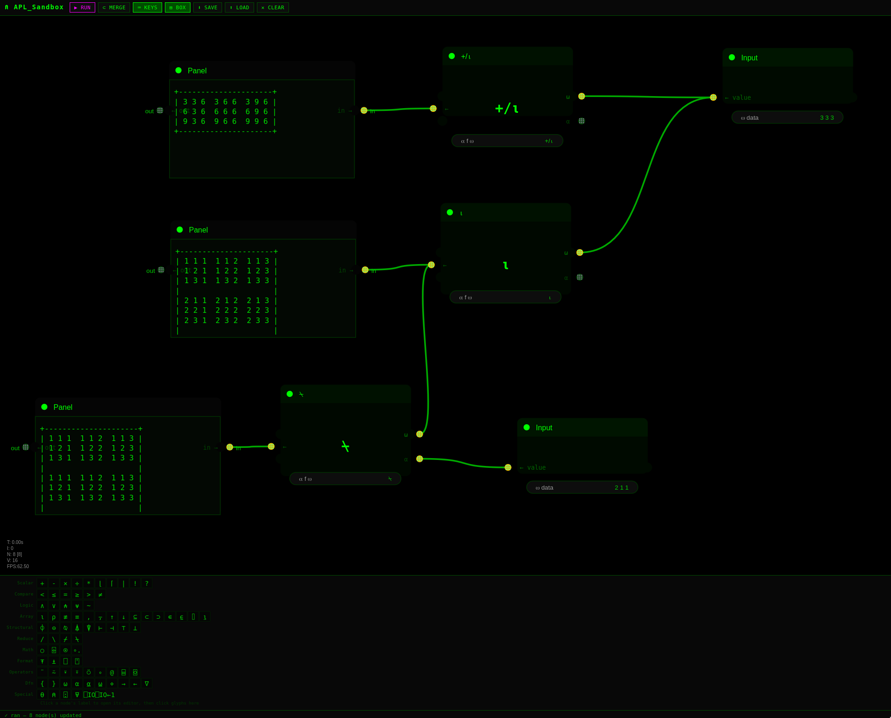

# APL_Sandbox

A visual node-based environment for learning and exploring Dyalog APL.
Connect nodes representing APL glyphs, trains, and dfns to build
expressions interactively — with live evaluation and panel output
at each step, similar to Grasshopper for Rhino 3D.

Built with [litegraph.js](https://github.com/jagenjo/litegraph.js).  
Vibe-coded with [Claude](https://claude.ai) (Anthropic).

---

## What it does

Data flows **right to left**, matching APL's evaluation order.
Place an Input node on the right, connect it to a Function node,
connect the result to a Panel node on the left.

**Node types**

- **Input** — enter any APL literal: `1 2 3`, `3 3⍴⍳9`, `'hello'`.  
  The output port (`← value`) is on the left side of the node.

- **Function** — type any APL expression: a single glyph (`⍳`), a
  reduction (`+/`), a train (`+/÷≢`), or a dfn (`{⍺+⍵}`).  
  Right argument **⍵** and optional left argument **⍺** are both on the
  right side; the result **←** exits from the left.

- **Panel** — displays the evaluated result of whatever is connected to
  it. Resize by dragging the bottom-right corner. The `in →` port is on
  the right; `← out` passes the value through on the left.

- **→ Rhino Point** — sends a 3-element coordinate array to a running
  Rhino 7 instance over TCP (requires the Rhino receiver script; see
  below).

**Right-click the canvas** to add nodes. Only APL node types appear in
the search.

---

## Requirements

- Python 3.7+
- [Dyalog APL](https://www.dyalog.com/download-zone.htm) (free for
  non-commercial use) — specifically the `dyalogscript` binary

---

## Installation

```bash
git clone https://github.com/duanerobot/APL_Sandbox
cd APL_Sandbox
python3 server.py
```

Then open **http://localhost:5000** in a browser.

The server auto-detects `dyalogscript` if it is on your `PATH`. If not
found, set `DYALOG_PATH` at the top of `server.py`:

```python
DYALOG_PATH = '/path/to/dyalogscript'
```

No other Python dependencies. litegraph.js is loaded from CDN.

---

## Toolbar

| Button | Action |
|--------|--------|
| **▶ RUN** | Evaluate the entire graph |
| **⊂ MERGE** | Combine 2 selected Function nodes into a train |
| **⌨ KEYS** | Toggle the APL glyph keyboard panel |
| **☐ BOX** | Toggle box display for all Panel output |
| **⬇ SAVE** | Save graph to `apl_sandbox.json` |
| **⬆ LOAD** | Load a previously saved graph |
| **✕ CLEAR** | Clear the canvas |

---

## Keyboard shortcuts

| Key | Action |
|-----|--------|
| `Ctrl+Enter` | Run graph |
| `Ctrl+S` | Save graph |
| `Ctrl+Z` | Undo (40-step history) |
| `Ctrl+Y` / `Ctrl+Shift+Z` | Redo |
| `Escape` | Close node-search dialog |
| `Delete` | Delete selected node |

---

## APL glyph keyboard

Click **⌨ KEYS** to open the glyph panel at the bottom of the screen.
First open a node's text field by clicking its label, then click any
glyph to insert it at the cursor. Hover over a glyph for a description
similar to RIDE's glyph bar (e.g. `⍳  Iota — Index Generator | Index
Of   e.g. ⍳5 → 1 2 3 4 5`).

APL keyboard input via your system layout also works in any text field.

---

## Merge

Select exactly two Function (or Input) nodes and click **⊂ MERGE**.
The nodes are sorted left-to-right in canvas space and combined as a
space-separated train: `leftExpr rightExpr`. A new Function node is
created below the selection with the combined expression.

Example: merge `+/` and `⍳` → `+/ ⍳`, which applied to `5` gives `15`.

---

## Box display

Click **☐ BOX** to toggle boxed output on Panel nodes. When on,
the server attempts `⎕SE.Dyalog.Utils.display` (which produces
RIDE-style nested-array boxes); if that is unavailable it falls back
to a pure-APL `+--+` boxer that works in any Dyalog installation.

---

## Rhino integration

`Rhino_Receiver.py` is an IronPython script that listens on TCP port
6789 and adds geometry to the open Rhino document. To use it:

1. Open Rhino 7 and run `Rhino_Receiver.py` from the script editor
   (or set it to run on startup).
2. Add a **→ Rhino Point** node in APL_Sandbox, wire a 3-element
   coordinate array into it, and run the graph.

The receiver script handles both single points (`type: point`) and
batches (`type: points`). The Rhino status indicator in the toolbar
shows the configured host and port.

---

## Security note

The server executes APL code locally via `dyalogscript` with no
sandboxing. It binds to `localhost` only and must not be exposed to
a network.

---

## License

MIT — see [LICENSE](LICENSE).

Dyalog APL is a separate product with its own licence.  
See [dyalog.com/prices-and-licences](https://www.dyalog.com/prices-and-licences.htm).

---

## Acknowledgements

- [litegraph.js](https://github.com/jagenjo/litegraph.js) by Javi Agenjo — MIT licence
- [Dyalog APL](https://www.dyalog.com) — free for non-commercial use
- Vibe-coded with Claude (Anthropic)
